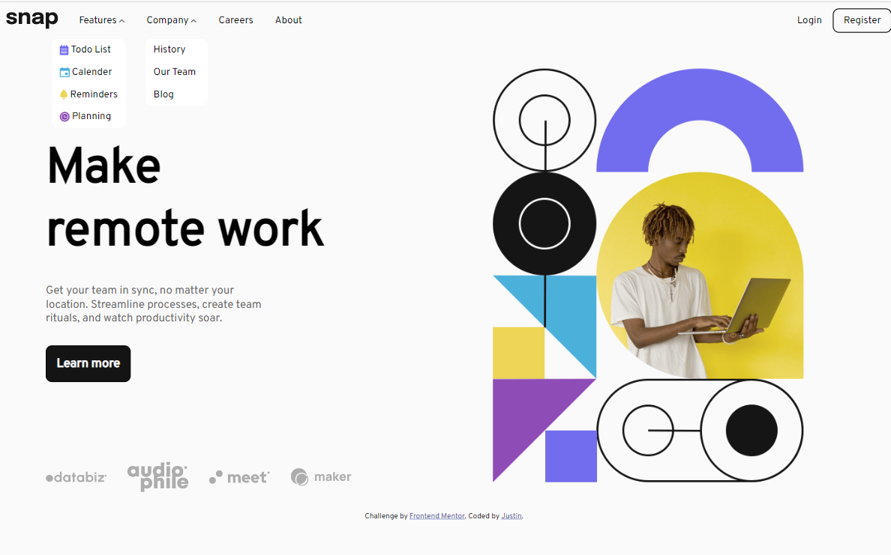
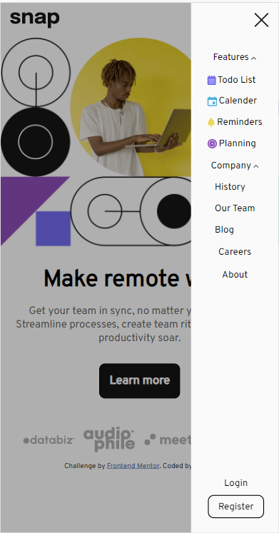

# Frontend Mentor - Intro section with dropdown navigation solution

This is a solution to the [Intro section with dropdown navigation challenge on Frontend Mentor](https://www.frontendmentor.io/challenges/intro-section-with-dropdown-navigation-ryaPetHE5). Frontend Mentor challenges help you improve your coding skills by building realistic projects. 

## Table of contents

- [Overview](#overview)
  - [The challenge](#the-challenge)
  - [Screenshot](#screenshot)
  - [Links](#links)
- [My process](#my-process)
  - [Built with](#built-with)
  - [What I learned](#what-i-learned)
  - [Continued development](#continued-development)
  - [Useful resources](#useful-resources)
- [Author](#author)
- [Acknowledgments](#acknowledgments)

**Note: Delete this note and update the table of contents based on what sections you keep.**

## Overview

### The challenge

Users should be able to:

- View the relevant dropdown menus on desktop and mobile when interacting with the navigation links
- View the optimal layout for the content depending on their device's screen size
- See hover states for all interactive elements on the page

### Screenshot






### Links

- Solution URL: [github](https://github.com/jjustin-35/intro-section-with-dropdown-navigation-main)
- Live Site URL: [github page](https://jjustin-35.github.io/intro-section-with-dropdown-navigation-main/)

## My process

### Built with

- Semantic HTML5 markup
- CSS
- Flexbox
- JavaScript
- [Jquery](https://jquery.com/) - JS library

### What I learned

I learned that how to make the dropdown menu. I used the CSS to make the dropdown menu in desktop design. However, since the mobile design is different from desktop design, I took a lot of time to deal with the dropdown menu, and finally completed it by using JavaScript and Jquery.

To see wha I made, see below:

```html
<ul class="option">
      <li class="subList" id="feature">
        <a href="#">Features</a>
        <ul class="dropdown">
          <li><a href="#">Todo List</a></li>
          <li><a href="#">Calender</a></li>
          <li><a href="#">Reminders</a></li>
          <li><a href="#">Planning</a></li>
        </ul>
      </li>
      <li class="subList" id="company"><a href="#">Company</a>
      <ul class="dropdown">
        <li><a href="#">History</a></li>
        <li><a href="#">Our Team</a></li>
        <li><a href="#">Blog</a></li>
      </ul>
      </li>
</ul>
```
```scss
ul{
    display: flex;
    list-style-type: none;
    justify-content: center;
    li{
        display: flex;
        justify-content: center;
        align-items: center;
        &.subList{
            flex-direction: column;
            position: relative;
            z-index: 4;
            ul.dropdown{
                flex-direction: column;
                position: absolute;
                top: 100%;
                right: 1rem;
                  li{
                    justify-content: flex-start;
                    a{
                        font-size: 16px;
                        display: flex;
                        align-items: center;
                        border: none;
                        padding: 0.5rem 0.8rem;
                        img{
                            padding: 0;
                            padding-right: 0.2rem;
                        }
                    }
                }
            }
            &#company{
                ul.dropdown{
                    right: 0;
                    left: 1rem;
                }
            }
        }
    }
  }
```
```js
let features = document.querySelector('#feature');
let company = document.querySelector('#company');

let subListElements = [features, company];

subListElements.forEach(element => {
    element.addEventListener('click', () => {
        let dropdown = element.children[1];
        if (size > 646) {
            dropdown.classList.toggle('visibility');
        }
    })
})

// Jquery(mobile)
let $feature = $('#feature');
let $company = $("#company");
let list = [$feature, $company];

list.forEach((element) => {
    element.on('click', function () {
        if (size <= 646) {
            element.children('.dropdown').slideToggle();
        }
    })
})
```

Also, I learned how to make the site change its design when the window size is changing. When resizing, the content in the site should also change its design and function. I learned how to use the resize event to make it change the content when resizing.
See below: 
```js
let size = window.outerWidth;
window.addEventListener('resize', () => {
    size = window.outerWidth;
    if (size > 646) {
        let blackBack = document.querySelector('.blackBack');
        blackBack.style = 'visibility: hidden; opacity: 0;'
    }
})

subListElements.forEach(element => {
    element.addEventListener('click', () => {
        let dropdown = element.querySelector('.dropdown');
        if (size > 646) {
            dropdown.classList.toggle('visibility');
        }
    })
})
```

### Useful resources

- [[基礎課程] jQuery 教學（一）：基礎觀念](https://summer10920.github.io/2020/04-23/jq-baseclass-1/#selector-%E9%81%B8%E5%8F%96) - This helped me to learn how to use the jQuery.
- [純CSS的下拉式選單](https://www.astralweb.com.tw/pure-css-drop-down-menu/) - This helped me to design a dropdown menu with css without js. Although I still use js to the dropdown menu, this is still very helpful.

## Author

- Website - [Justin Chen](https://github.com/jjustin-35/)
- Frontend Mentor - [@jjustin-35](https://www.frontendmentor.io/profile/jjustin-35)
- Twitter - [@e\Vmd7EMdBkFjSEZz](https://twitter.com/Vmd7EMdBkFjSEZz)